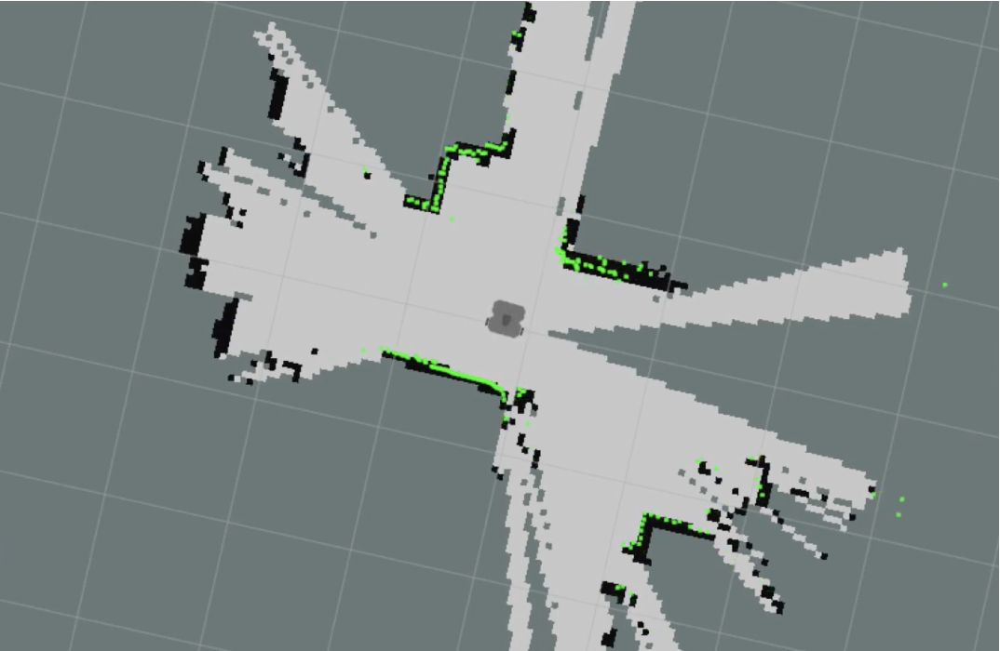

# Turtlebot SLAM with Yolo Object Detection

이 연구는 2022년 경희대학교 소프트웨어융합학과 로봇비전트랙 캡스톤디자인으로 수행된 것입니다. 

## 요약

> 이 연구는 기존 Gmapping SLAM 에서 제작되는 지도에서 "물체에 대한 정보" 는 알 수 없다는 문제를 
해결하기 위해서 단안 카메라와 Yolo Object Detection 을 추가로 이용해 ROS 좌표계 변환을 통해 
물체의 이름을 포함하는 2D 지도를 제작하였다.
> 

## 목차

> 1. 목표 설정 배경
2. 목표
3. 구현 과정
	3-1. 시스템 디자인
	3-2. YoloTurtle 패키지 제작
	3-3. 실험 과정
4. 수행 결과
	4-1. 구현 성능
	4-2. 구현 정도 평가
	4-3. 우수성
	4-4. 한계
5. Dependencies
	5-1. Dependencies
	5-2. 사용 장비
6. 향후 기대 효과 및 활용 방안
> 

## 1. 목표 설정 배경

기존의 Occupancy Grid Map

기존의 LiDAR SLAM 메소드는 Occupancy Grid Map 형태로 출력되어 **갈 수 있는 곳 / 가지 못 하는 곳**의 구분만 있을 뿐, 
구체적인 공간의 구성은 알 수 없었다.

따라서 공간이 **무슨 물품으로 구성되었는지**에 대한 정보까지 포함한 지도가 생성된다면, 더 많은 활용 방안이 생길 것이라고 생각했다.

## 2. 목표

> **Yolo** 와 **Gmapping SLAM** 을 합쳐 물체의 이름이 표시되는 2차원 지도 제작
> 

## 3. 구현 과정

### 3-1. 시스템 디자인

개별 지도를 합쳐 전체 지도 제작

물체의 라벨이 표시된 최종적인 지도를 얻기 위해서, 

검출된 물체만으로 각각 지도를 만들어 이를 합치는 방법을 고안했다. 

이를 위해서는 해당 물체의 거리 정보만을 발행하는 ROS 패키지가 
필요했다. 

### 3-2. YoloTurtle 패키지

기능 : Bounding Box 외부의 LiDAR 포인트는 폐기하고 **내부에 있는 포인트만 발행**

1. Subscribe 
    1. scan
    2. darknet_ros/bounding/box
    3. camera_info
    4. image_raw

1. Publish
    1. bounding box 내부에 속한 LiDAR 데이터 (sensor_msgs::LaserScan)
    2. 카메라 화각 내부의 LiDAR 데이터

최종 시스템 구성도

YoloTurtle 패키지 실행을 통해 농구공에 해당하는 
LiDAR 데이터만 재발행 하는 모습

농구공 데이터만 가지고 만든 지도와 전체 지도를 
비교할 수 있다. 

### 3-3. 실험 과정

시스템의 성능을 테스트하기 위해 두 가지 실험을 진행했다.                          

실험 1. 농구공만 있는 환경

## 4. 수행 결과

### 4-1. 구현 성능

실험2. 농구공과 책이 있는 환경

- 실험 1 결과

물체가 한 개일 때 단계별 생성 지도

실험 1 최종 결과물

- 실험 2 결과

물체가 두 개일 때 단계별 생성 지도

실험 2 최종 결과물

### 4-2. 구현 정도 자체 평가

- 성공 항목
    - 물체의 라벨이 붙은 2D 지도를 제작하였다.
    - 특정 물체에 대한 LiDAR 데이터만 선택적으로 발행하는 패키지를 제작하였다.
- 아쉬운 항목
    - 물체 선정에 한계가 있다.
    - 통제된 환경에서 실험을 진행했다.

### 4-3. 우수성

기존의 object detection 과 SLAM 을 합치려는 시도들은 Visual SLAM 분야에서 시행되어 결과물도 3D point cloud 형태로 나오는 경우가 많았다. 

LiDAR SLAM 과 YOLO 를 합치려는 시도는 드물었고 이 과정에서 제작한 YoloTurtle 패키지의 정확도가 높았다는 점에서 의미가 있다. 

### 4-4. 한계

- 물체 선정 자유도의 한계

책 측면은 인식되지 않아 scan 값도 없는 모습

Yolo 의 한계로 인해 
**어느 각도에서 보더라도 인식이 잘 되는 물체**여야만 
비교적 정확도가 높은 지도가 만들어졌다. 

- map 제작의 한계

 {: width="100" height="100"}

a. YoloTurtle 패키지에서 나온 토픽으로 제작한 지도 (sports ball)

 {: width="100px" height="100px"}

b. 기존 Gmapping SLAM 으로 제작한 지도 (sports ball)

(a) 와 같이 일부분의 거리 데이터만으로 제작한 지도는 형태가 흐트러져 물체와 닮지 않게 나오는 것을 볼 수 있다. 따라서 본 연구에서는 패키지를 통해 나온 지도를 물체의 위치만 참조하는 용도로 사용할 수 밖에 없었다. 

## 5. Dependencies

### 5-1. Software Dependencies

- ROS Melodic
- darknet_ros
- OpenCV
- Gmapping SLAM
- Turtlebot3
- usb_cam

### 5-2. 사용 장비

- Turtlebot3 Waffle Pi
- Nvidia Jetson nano Developer Kit
- Logitech webcam
- ASUS Laptop with RTX3080

## 6. 향후 기대 효과 및 활용 방안

- 기대 효과

실내 자율 주행 로봇에 대한 수요가 커지고 있는 상황에서 주변 환경에 대한 자세한 정보를 포함한 본 연구의 지도는 공정, 물류 운송 로봇 등 다양한 분야에서 사용될 수 있을 것이다.
- 활용 방안

현재는 Object Detection 에서 검출된 객체에 대한 지도를 제작하였지만 본 연구를 활용해 검출된 객체만 미포함하는 지도를 만든다면 사람이 많이 다니는 유동적인 공간에서도 지도를 만들 수 있을 것이다.